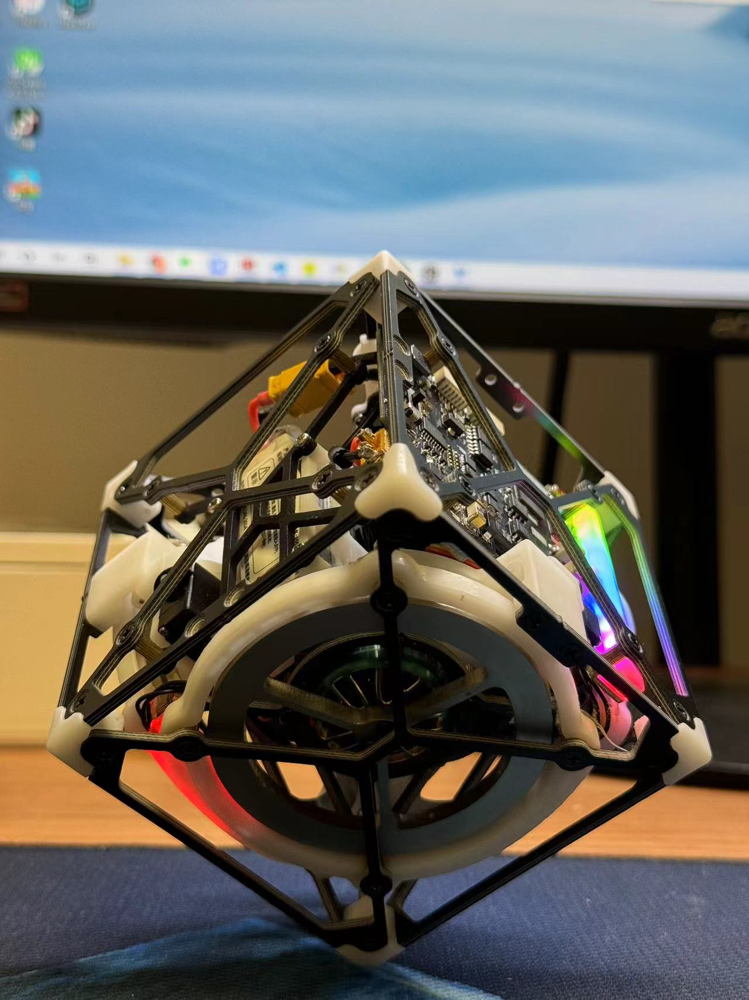

# Cubli_Mini_Ultra项目

**项目完全开源，任何人都可以根据本Github内容自行白嫖，当然也可以顺手点个Star**

## **责任声明：本项目飞轮峰值转速可达到6500RPM，具有一定的危险性，复刻本项目的同学如若发生任何意外，与本人无关**

### 介绍

本项目在Cubli_mini的基础上加上主动刹车，缩小体积。可自动起跳，实现边和点平衡。Cubli_Mini是一个8x8x8CM的立方体，主控集成3路电机驱动、控制、无线射频一体。增加了每个飞轮的外围一圈光污染，主控也增加一条光污染。

项目成本：≤1040RMB

**视频介绍：**[https://www.bilibili.com/video/BV1Gi421D7bc/?spm_id_from=333.999.0.0&vd_source=25617b52e7e0b6d56790cc1bea5b5be1](https://www.bilibili.com/video/BV1Gi421D7bc/?spm_id_from=333.999.0.0&vd_source=25617b52e7e0b6d56790cc1bea5b5be1)

### 资料说明

- 3D模型设计源文件
- 主控模块、IMU模块、编码器模块、下载模块硬件资料
  - BOM
  - 原理图
  - 位号图
  - Gerber
- 主控1、主控2软件工程
  - 主控模块使用两颗ESP32
- 串口调试助手&简易调参上位机
  - 串口
  - WIFI
- 各类文档说明
  - 对项目的一些说明，如调参，控制原理等
- 打样文件
  - STL格式3D打印文件
  - DWG格式钣金文件
  - BOM表
    - 结构BOM表
    - PCB元器件BOM表

### 结构设计

- 优化了角的结构件设计，通用

- 电池仓、光污染灯罩、刹车底座等使用3D打印文件

- 刹车片使用了70度优力胶聚氨酯板

- 电机安装顺序查看/5.Doc/Pic/电机顺序.png

### 电路模块

**主控模块：**

- 主控使用了单颗ESP32运行3路FOC，使用CAN与另一颗ESP32进行通信，驱动默认使用力矩模式
- FOC使用的Simple FOC，EG2133+6MOS+CC6920SO

**IMU模块：**

- 使用QMI8658A，便宜好用
- 为了防止应力，对IMU所在区域挖槽，减少安装应力。但使用了3颗螺丝硬连接，并不能避免应力问题，改进方案为使用软垫片并只拧紧一个螺丝进一步减少应力
- 为了避免结构干涉，安装与一面进行平行放置，对IMU的数据做旋转矫正

**编码器模块：**

- 采用的是MT6701，便宜好用，转速高

**自动下载模块：**

- 为了尽量减少主控的面积，因此单独把自动下载电路摘出来，参考官方自动下载电路

**注意事项：**

- 正常情况下，自动下载模块焊接排针，主控不焊接任何排针/排母

### 固件说明

MCU2运行3路Simple FOC电机驱动库、以及CAN反馈和接收控制命令

MCU1运行采集IMU，光污染，舵机、控制等任务

**注意事项：**

- 目前WIFI SSID和PSW，TCP Server IP Port全部是写死在固件里面，因此要想使用WIFI调参需要修改这些内容，详情请看Doc/使用和调参说明

### 打样说明

考虑到很多同学可能是第一次进行结构打样，因此提供了打样文件

**3D打印：**

- 文件位于：/6.Process/**3D打印**，该文件为STL格式，打样数量请查看同目录下的<**3D打印加工说明**>，可以在未来工厂或者嘉立创打样，首选光固化

**钣金件打样：**

- 文件位于：/6.Process/**钣金件**，**每个物料的都有对应的PDF和DWG文件，PDF文件方便查看，DWG文件用于激光切割/板材加工**。打样数量请查看同目录下的<**钣金加工说明**>，可以找淘宝给图纸直接加工。由于加工精度要求不高，个人用途下，公差全看加工厂的心情

**PCB打样：**

- 拿着Gerber文件出门左转嘉立创白嫖

**BOM表：**

- PCB BOM文件位于：/1.Hardware/
- 结构BOM文件位于：/6.Process/结构BOM，里面列有需要购买的**结构物料和链接**
- **注意事项：**
  - PCB BOM表是从AD源文件导出，工程会有重复用料，需要注意
  - **注意编码器需要3块，需要采购3套物料**
  - 如文件有遗漏的地方望提醒

### 控制算法

Cubli_Mini使用的是LQR来进行控制，也可以使用串级PID来进行控制。代码位于/需要修改/MCU1/control/cubli_mini

**边平衡**：

- 可以参考一阶倒立摆进行建模和求解参数。由于建立模型的参数比较难准确的获得，我求解得到的参数和最佳参数有些许出入。因此本项目大多数使用玄学调参工程师来整定参数

**点平衡：**

- 在边平衡的基础上添加对X，Z轴的控制。采用与边平衡一样的控制方法，详情看Doc/控制原理说明。

**研究型：**

- 请查看原版Cubli的论文

### 调参

**调节方法：**

- 可以使用UART和WIFI进行调参，WIFI需要连接到路由器，Cubli_Mini_Ultra为TCP客户端

**简易上位机**

- 使用了vofa+进行调参，使用了控件和命令绑定的方式进行调参，保存的文件位于：3.Software/vofa+.tabviews.json
- 只需要使用控件调参拖拽即可，无需了解任何命令